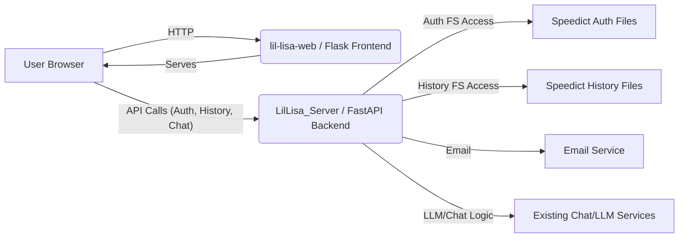

# Lil Lisa Web - Architecture and Design: Authentication & History

## 1. Introduction

This document details the proposed architecture and design for implementing passwordless email authentication and shared conversation history features, as specified in `requirements.md`. It reflects a distributed architecture:

*   **`lil-lisa-web` (Frontend):** The existing Flask application, repurposed primarily to serve the HTML/CSS/JavaScript interface and handle client-side interactions.
*   **`LilLisa_Server` (Backend):** The existing FastAPI application, extended to handle all authentication logic and history management using `speedict` for storage, and core API endpoints.

## 2. System Architecture Overview

## 3. Component Design: `lil-lisa-web` (Frontend)

*No significant changes from the previous version of this section. Responsibilities remain serving UI, managing client-side state (JWT in localStorage), and making API calls to `LilLisa_Server`.*

### 3.1. Role & Responsibilities
*   (As before)

### 3.2. Key Modifications (`main.py` - HTML/CSS/JS)
*   (As before)

### 3.3. Backend Dependencies (Flask App)
*   (As before)
*   **Remove:** Existing `/api/chat`, `/api/thumbsup`, `/api/thumbsdown` routes in `lil-lisa-web/main.py`.

## 4. Component Design: `LilLisa_Server` (Backend)

### 4.1. Role & Responsibilities

*   Provide secure API endpoints for authentication and data access.
*   Implement passwordless email login logic (token generation, verification, email sending).
*   Manage user identity (hashing emails, storing user domain info **in user-specific `speedict` auth store**).
*   Manage temporary login tokens (**in a global `speedict` auth store**).
*   Issue and validate persistent authentication tokens (JWTs).
*   Interact with **`speedict` file storage** for both authentication data and conversation history.
*   Modify existing chat endpoints (`/invoke`) to check authentication and log history **to `speedict`**.
*   Provide endpoint to retrieve conversation history **from `speedict`** with filtering, searching, and pagination (performing filtering/sorting in memory).
*   Integrate with an email sending service.
*   **Implement cleanup mechanism for expired global login tokens.**

### 4.2. Key Additions/Modifications

*   **Dependencies:**
    *   FastAPI, Uvicorn.
    *   `speedict` library (already present).
    *   Python-JOSE or PyJWT (for JWT handling).
    *   Email library (e.g., `fastapi-mail` or `smtplib`).
    *   Hashing library (e.g., `passlib[bcrypt]` or `hashlib`).
    *   `python-dotenv` (for config).
    *   **Remove:** SQLAlchemy dependency if no longer needed for anything else.
*   **Configuration (`.env` / Environment Variables):**
    *   `SPEEDICT_FOLDERPATH`: Base path for `speedict` data (existing).
    *   `AUTH_INFO_FOLDENAME`: Subfolder name for auth data (new).
    *   `CONVERSATION_HISTORY_FOLDENAME`: Subfolder name for history data (as before).
    *   `GLOBAL_AUTH_TOKENS_FILENAME`: Name for the global login token `speedict` file (e.g., `_global_auth_tokens`) within `AUTH_INFO_FOLDENAME`.
    *   JWT settings (`JWT_SECRET_KEY`, `JWT_ALGORITHM`, `ACCESS_TOKEN_EXPIRE_MINUTES`).
    *   Email server settings (`MAIL_SERVER`, etc.).
    *   Email validation (`ALLOWED_EMAIL_DOMAINS` or `BLOCKED_EMAIL_DOMAINS`).
    *   Email hashing salt (`EMAIL_HASH_SALT`).
    *   Login token expiry (`LOGIN_TOKEN_EXPIRE_MINUTES`).
*   **Authentication Storage (`speedict`):**
    *   **Global Login Tokens:** Stored in `<SPEEDICT_FOLDERPATH>/<AUTH_INFO_FOLDENAME>/<GLOBAL_AUTH_TOKENS_FILENAME>/`. Key: `login_token`, Value: `{ "email": ..., "expires_at": ... }`.
    *   **User Auth Info:** Stored in `<SPEEDICT_FOLDERPATH>/<AUTH_INFO_FOLDENAME>/<user_id_hash>/`. Key: `'user_info'`, Value: `{ "domain": ... }`.
*   **History Storage (`speedict`):**
    *   **Structure:** `<SPEEDICT_FOLDERPATH>/<CONVERSATION_HISTORY_FOLDENAME>/<domain>/<user_id_hash>/`
    *   **Data:** Within each user folder, list under key `'history'`. Item: `{ "session_id": ..., "user_id": ..., "title": ..., "first_query": ..., "created_at": ... }`.
*   **Utility Functions:**
    *   Email hashing function.
    *   JWT creation/decoding.
    *   Auth dependency function (get user hash from JWT).
    *   **Auth path generation functions:** For global token store path and user-specific auth store path.
    *   **History path generation function.**
    *   **`speedict` loading/saving wrapper functions** (reusable for auth and history stores).
    *   **Expired token cleanup function:** To run periodically on the global token store.
*   **New API Endpoints (`/api/auth` router):**
    *   `POST /api/auth/request_login`: Takes email. Validates domain. Creates `login_token`. Saves `token -> {email, expiry}` in **global token store**. Sends email.
    *   `GET /api/auth/verify_token`: Takes `login_token`. Looks up in **global token store**. If valid, gets email, **deletes from global store**. Hashes email -> `user_id_hash`, gets domain. Saves `{'domain': domain}` in **user auth store**. Generates JWT. Returns JWT + user info.
    *   `POST /api/auth/verify_session`: Takes JWT. Verifies signature, extracts `user_id_hash`. Checks existence of **user auth store** and loads `domain`. Returns user info.
    *   `POST /api/auth/logout`: (Optional) (As before).
*   **API Endpoint Modifications:**
    *   `POST /invoke` / `POST /invoke_stream`:
        *   Add auth dependency (gets `user_id_hash`, `domain`).
        *   If authenticated and first call for `session_id` (check user's history store), generate `title`, get user's history path, load/append/save history entry **to user's history `speedict` DB**.
*   **New API Endpoint:**
    *   `GET /api/history`:
        *   Requires JWT auth (gets `user_id_hash`, `domain`).
        *   Parses params.
        *   **Retrieval:** Reads from user history store or iterates domain history stores (as before).
        *   **In-Memory Processing:** (As before).
        *   Return list.

### 4.3. Email Sending

*   (As before).

## 5. Configuration Management

*   **`lil-lisa-web`:** Needs `LIL_LISA_SERVER_URL`.
*   **`LilLisa_Server`:** Needs `SPEEDICT_FOLDERPATH`, `AUTH_INFO_FOLDENAME`, `CONVERSATION_HISTORY_FOLDENAME`, `GLOBAL_AUTH_TOKENS_FILENAME`, JWT, Mail, Domain, Salt, Expiry settings. **No** `SQLALCHEMY_DATABASE_URI`.

## 6. Potential Future Improvements

*   **Refactor Frontend:** (As before).
*   **History/Auth Query Performance:** (As before - iterating many files can be slow).
*   **Global Token Store Cleanup:** Ensure the cleanup mechanism is robust.
*   **Error Handling & Testing:** (As before).
*   **Token Storage:** (As before).
*   **History Interaction (V2):** (As before).

## 7. Implementation Plan (Suggested Phases)

**Phase 1: Backend Setup & Core (`LilLisa_Server`)**
*   Add dependencies (JWT lib, Mail lib, passlib/hashlib - `speedict`, FastAPI should exist).
*   Set up configuration loading (incl. `AUTH_INFO_FOLDENAME`, `CONVERSATION_HISTORY_FOLDENAME`, `GLOBAL_AUTH_TOKENS_FILENAME`).
*   Implement email hashing utility.
*   Implement JWT utility functions.
*   Implement **`speedict` path generation and loading/saving utility functions**.
*   Implement **expired token cleanup utility**.

**Phase 2: Backend Authentication API (`LilLisa_Server`)**
*   Implement `/api/auth/request_login` (uses global token store).
*   Implement `/api/auth/verify_token` (uses global token store & user auth store).
*   Implement `/api/auth/verify_session` (uses user auth store).
*   Implement `/api/auth/logout` (optional).
*   Implement auth dependency function.

**Phase 3: Frontend Authentication UI & Logic (`lil-lisa-web`)**
*   (As before).

**Phase 4: Backend History API & Logic (`LilLisa_Server`)**
*   Modify `/invoke` to check auth and save history record **to user history `speedict` store**.
*   Implement `/api/history` endpoint **reading from history `speedict` stores**.

**Phase 5: Frontend History UI & Logic (`lil-lisa-web`)**
*   (As before).

**Phase 6: Refinement & Testing**
*   (As before).
